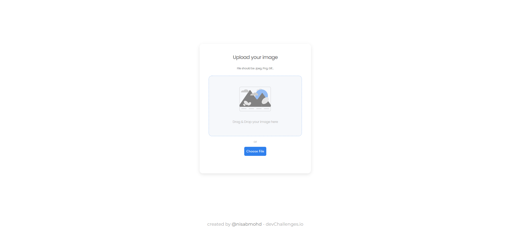
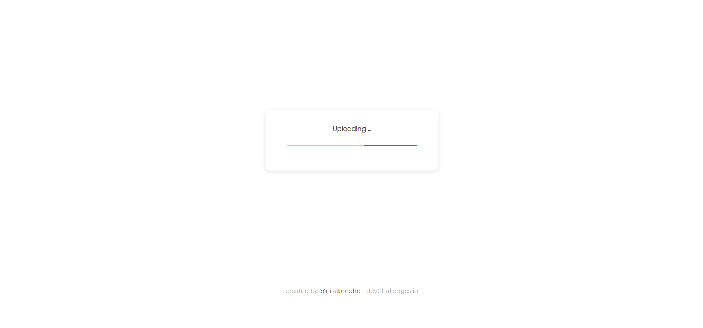
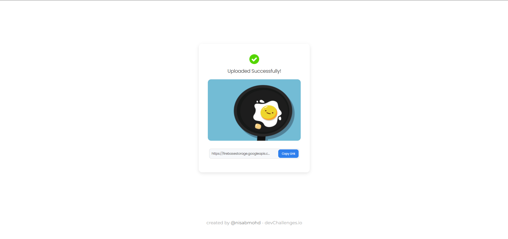

<h1 align="center">Image Uploader Challenge</h1>

<div align="center">
   Solution for a challenge from  <a href="http://devchallenges.io" target="_blank">Devchallenges.io</a>.
</div>

<div align="center">
  <h3>
    <a href="https://image-uploader-challenge-beta.vercel.app/">
      Demo
    </a>
    <span> | </span>
    <a href="https://github.com/nisabmohd/image-uploader-challenge">
      Solution
    </a>
    <span> | </span>
    <a href="https://devchallenges.io/challenges/O2iGT9yBd6xZBrOcVirx">
      Challenge
    </a>
  </h3>
</div>

<!-- TABLE OF CONTENTS -->

##  Features
- Drag and Drop functionality
- Select image otherwise
- Valid extension check
- Supported format : png , jpg , jpef , gif

<!-- OVERVIEW -->

## Overview


<br>

<br>


### Built With

- [React](https://reactjs.org/)

##

This application/site was created as a submission to a [DevChallenges](https://devchallenges.io/challenges) challenge. The [challenge](https://devchallenges.io/challenges/O2iGT9yBd6xZBrOcVirx) was to build an application to complete the given user stories.

## How To Use

<!-- Example: -->

To clone and run this application, you'll need [Git](https://git-scm.com) and [Node.js](https://nodejs.org/en/download/) (which comes with [npm](http://npmjs.com)) installed on your computer. From your command line:

```bash
# Clone this repository
$ git clone https://github.com/nisabmohd/image-uploader-challenge.git

# Install dependencies
$ npm install

# Run the app
$ npm start
```
## Contact

- Website [portfolio](https://https://nisabmohd.github.io/portfolio/)
- GitHub [@nisabmohd](https://github.com/nisabmohd)
- Twitter [@mohdnisab](https://twitter.com/mohdnisab)
